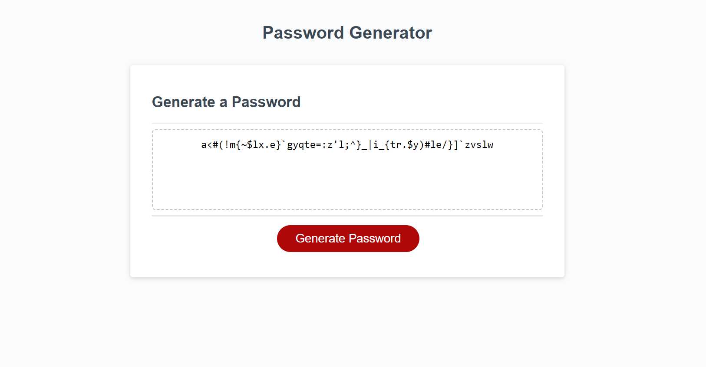

# Password Generator Starter Code

## Description
Using the code give to me by the Bootcamp - I created a password generator based on my knowledge gained within the class.

## Links
Repository: https://github.com/annapng/passwordGen
Deployed Link: https://annapng.github.io/passwordGen/

## Screenshot
Example password using only lowercase letters and symbols:

## User Story
AS AN employee with access to sensitive data
I WANT to randomly generate a password that meets certain criteria
SO THAT I can create a strong password that provides greater security

## Acceptance Criteria
[x] GIVEN I need a new, secure password
[x] WHEN I click the button to generate a password
[x] THEN I am presented with a series of prompts for password criteria
[x] WHEN prompted for password criteria
[x] THEN I select which criteria to include in the password
[x] WHEN prompted for the length of the password
[x] THEN I choose a length of at least 8 characters and no more than 128 characters
[x] WHEN asked for character types to include in the password
[x] THEN I confirm whether or not to include lowercase, uppercase, numeric, and/or special characters
[x] WHEN I answer each prompt
[x] THEN my input should be validated and at least one character type should be selected
[x] WHEN all prompts are answered
[x] THEN a password is generated that matches the selected criteria
[x] WHEN the password is generated
[x] THEN the password is either displayed in an alert or written to the page